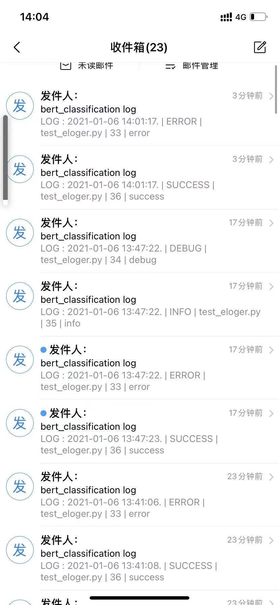

# eloguru: email for loguru

## 带邮件功能的loguru

## install

- clone source

```shell
git clone https://github.com/425776024/eloger.git
```

- pip

```shell
pip install eloger
```

## des

> Loguru with mail function
>
> 带邮件功能的loguru
>

- setting elogger.mail_config , then all operations are the same as [loguru](https://github.com/Delgan/loguru)
- then all the [loguru](https://github.com/Delgan/loguru) logs will be sent to the
  mailbox:`elogger.mail_config.receive_emails`

## config mail server

- [网易邮箱](http://help.mail.163.com/faqDetail.do?code=d7a5dc8471cd0c0e8b4b8f4f8e49998b374173cfe9171305fa1ce630d7f67ac2cda80145a1742516)
- [qq 邮箱](https://service.mail.qq.com/cgi-bin/help?subtype=1&&no=1001256&&id=28)
- [gmail](https://support.google.com/mail/answer/7126229?hl=zh-Hans)

## use

```python
from eloger import elogger

elogger.mail_config.sender_email = "Your email"
elogger.mail_config.sender_email_passwd = "Your email Authorization code"
elogger.mail_config.sender_email_mailserver = "Your email server, like: smtp.163.com"
elogger.mail_config.sender_email_mailserver_port = "Your email server's port , like : 25"
elogger.mail_config.title = "Your email message title , like : this is a log message title"
elogger.mail_config.body = "Your email message content template , like : <br/>#msg<br/> (#msg Will be replaced by log message)"
elogger.mail_config.receive_emails = [
    "Your email send to Email account 1",
    "Your email send to Email account 2",
]

# All operations are the same as loguru
elogger.add('a.log', rotation='50 MB')
elogger.add('a.log')
elogger.error('error', email=True)
elogger.debug('debug')
elogger.info('info')
elogger.success('success', email=True)

# then all the above logs will be sent to the mailbox:'elogger.mail_config.receive_emails'
```

